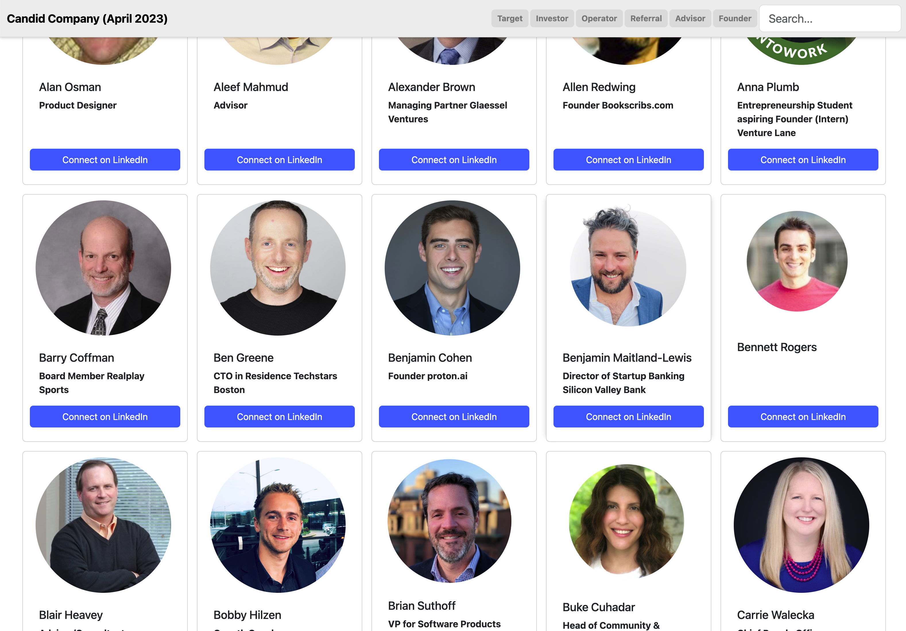

# My Network Lookbook

This is a personal networking look-book. I am working on a suite of tools to help intentional networks
be more intentional about all aspects of their outreach. Strong networks are amazing, really strong networks
are the foundation of communities.

[Live Site](http://network.StephanSmith.solutions)

## Features

* Full-JavaScript/frontend implementation based on [instantsearch.js](https://community.algolia.com/instantsearch.js/)
* Results page refreshed as you type.
* Hits & Facets.
* Relevant results from the first keystroke.
* Typo-tolerance
* Backup search parameters in the URL

### Venture Lane
Venture Lane is a B3B SAS Accelerator and Co-working space for startups facing the same 
set of scaling challenges. It is also the hard of a growing startup community.

[Learn More](https://networking-book.stephansmith.solutions/)